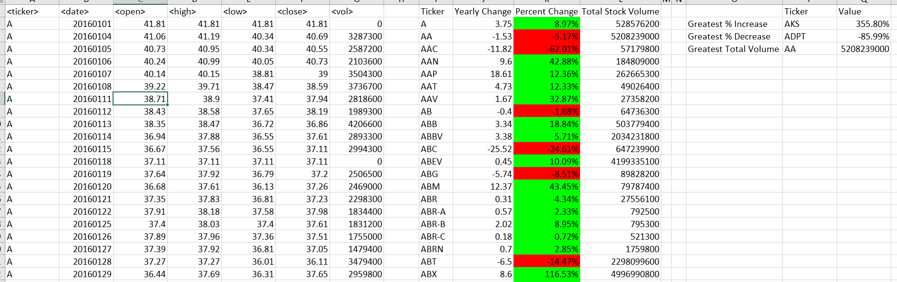

# VBA-Challenge
# Stock analysis
## By Michael Thomas

The goal of this project was to explore stock data and creating summary tables.

Excel was used to provide the information. 
VBA macros were used to calculate summary data and create tables.

## DATA
All data in our tables was provided in an excel document containg the given table information:
- ticker	
- date	
- open	
- high	
- low	
- close
- volume

## VBA macros

I wrote a VBA module macro that loops through each worksheets data and outputs the following:

- The ticker symbol.

- Yearly change from opening price at the beginning of a given year to the closing price at the end of that year.

- The percent change from opening price at the beginning of a given year to the closing price at the end of that year.

- The total stock volume of the stock.

- Conditional formatting that will highlight positive change in green and negative change in red.

- Greatest increase.

- Greatest Decrease.

- Greatest Total Volume.

